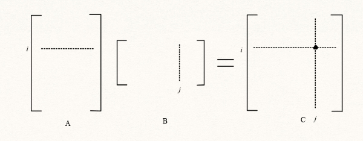
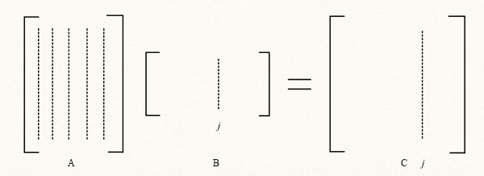
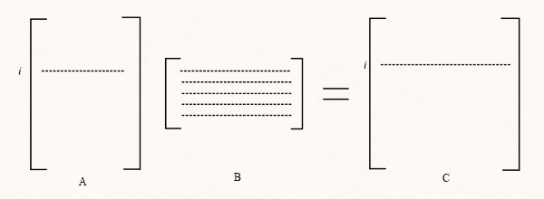
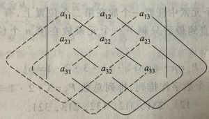
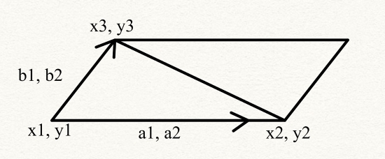
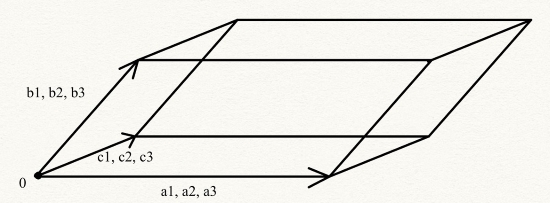
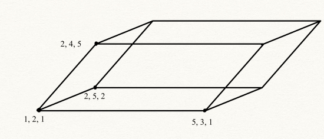
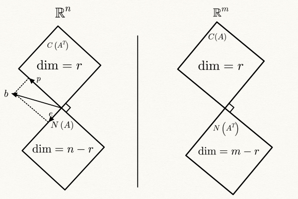

# 线性代数 Linear Algebra

*I bet I have to take more than a month to finish this markdown + LaTeX note. Hope it worth my time. Besides, see this note as my first attempt to write math notes digitally.*
*Andrew 2022.5.27*

注: 导出的时候记得打开markdown preview enhanced 插件

- [线性代数 Linear Algebra](#线性代数-linear-algebra)
  - [1. Basics](#1-basics)
    - [1.1 重要的基本定义](#11-重要的基本定义)
    - [1.2 基本加法和乘法](#12-基本加法和乘法)
    - [1.3 矩阵相乘的不同解读方法](#13-矩阵相乘的不同解读方法)
    - [1.4 AX=b的引入和消元法](#14-axb的引入和消元法)
    - [1.4 逆 (Inverse) 和 $A=LU$](#14-逆-inverse-和-alu)
  - [2. 行列式](#2-行列式)
    - [2.1行列式的定义和性质](#21行列式的定义和性质)
    - [2.2 行列式的计算](#22-行列式的计算)
    - [2.3 克拉默法则 Cramer's rule](#23-克拉默法则-cramers-rule)
    - [2.4 行列式的应用: 面积体积求解](#24-行列式的应用-面积体积求解)
  - [3. AX=0, AX=b](#3-ax0-axb)
    - [3.1 Ax=0](#31-ax0)
    - [3.2 $Ax=b$ 可解性](#32-axb-可解性)
    - [3.3 $Ax=b$](#33-axb)
    - [3.4 秩 (Rank)](#34-秩-rank)
  - [4. 空间 (Space)](#4-空间-space)
    - [4.1 空间的基本概念](#41-空间的基本概念)
    - [4.2 线性无关, 基和维度](#42-线性无关-基和维度)
    - [4.3 四种基本子空间](#43-四种基本子空间)
    - [4.3 总结: 四种基本子空间](#43-总结-四种基本子空间)
    - [4.4 其它类型的空间](#44-其它类型的空间)
  - [5. 正交](#5-正交)
    - [5.1 正交的基本概念](#51-正交的基本概念)
    - [5.2 投影](#52-投影)
    - [5.3 最小二乘法](#53-最小二乘法)
    - [5.4 施密特正交化](#54-施密特正交化)
  - [6. 线性变换和基变换](#6-线性变换和基变换)
  - [6. 特征值和特征向量](#6-特征值和特征向量)
    - [6.1 性质和计算](#61-性质和计算)
    - [6.2 对称矩阵的对角化](#62-对称矩阵的对角化)
    - [6.3 马尔可夫矩阵 (Markov matrices)和傅里叶级数](#63-马尔可夫矩阵-markov-matrices和傅里叶级数)
  - [7. 正定 (Positive definiteness)和对称矩阵](#7-正定-positive-definiteness和对称矩阵)
    - [7.1 $Q \Lambda Q^T$](#71-q-lambda-qt)
    - [7.2 正定应用: 黑塞矩阵和多元函数极值问题](#72-正定应用-黑塞矩阵和多元函数极值问题)

强制换页符

## 1. Basics
### 1.1 重要的基本定义
> **$m \times n$矩阵**：
>>m行n列
>>$$ \begin{bmatrix}
a_{11} & \cdots & a_{1n}\\
a_{21} & \cdots & a_{2n} \\
\vdots &  & \vdots \\
a_{m1} & \cdots & a_{mn}\\
\end{bmatrix}
$$

>**线性相关 (Linear dependent):**
>>给定向量组$a_1, a_2, ..., a_n$, 如果存在**不全为零**的$c_1, c_2, ..., c_n$使得 $$ c_1a_1+c_2a_2+...c_na_n=0 $$ 则向量组线性相关的
>  

>**转置 (Transpose)：**
>> $$ A_{ij}^T=A_{ji} $$
>>如果A^T=A, A是对称矩阵(symmetric)

>**逆(Inverse):**
>> 如果$A^{-1}A$=$AA^{-1}=I$,  $A^{-1}$是方阵$A$的逆

>**张成(Span):**
>>向量$a_1, a_2, ..., a_n$张成一个空间，当此空间包含这些向量所有线性组合。张成空间(Spanned space) 是包含这些向量的最小子空间
>  

>**基 (Basis)：**
>>线性空间 $V$ 中向量$a_1, a_2, ..., a_n$ **线性无关**且**张成整个$V$** (任何一个$V$中向量可以用$a_1, a_2, ..., a_n$ 表示), 他们即为$V$中的一个基
>  

>**维数(Dimension):**
>> If basis is $a_1, a_2, ..., a_n$, than the dimension equals to $n$.
>  

>**正交 (orthogonal)：**
>>$x^Ty=y^Tx=0$, 内积为0时，向量$x$, $y$正交
>  

>**秩 (rank)：**
>>矩阵的秩等于主列和主元的数量
>  

>**正定(positive definite)：**
>

### 1.2 基本加法和乘法
**矩阵加法：**
当矩阵AB同为 $m \times n$ 时:
1. **A**+**B**=**B**+**A**
2. (**A**+**B**)+**C**=**A**+(**B**+**C**)
$$
\textbf{A}+\textbf{B}=
\begin{bmatrix}
a_{11}+b_{11} & \cdots & a_{1n}+b_{1n}\\
a_{21}+b_{21} & \cdots & a_{2n}+b_{2n} \\
\vdots &  & \vdots \\
a_{m1}+b_{m1} & \cdots & a_{mn}+b_{mn}\\
\end{bmatrix}
$$

**矩阵数乘:**
1. $(\lambda +\mu)A=\lambda A+\mu A$
2. $\lambda (A+B)=\lambda A+\lambda B$
  $$
\lambda \textbf{A}=
\begin{bmatrix}
\lambda a_{11}& \cdots & \lambda a_{1n}\\
\lambda a_{21} & \cdots & \lambda a_{2n}\\
\vdots &  & \vdots \\
\lambda a_{m1}& \cdots & \lambda a_{mn}\\
\end{bmatrix}
$$

**矩阵相乘：**
矩阵A ($m \times n$) 乘矩阵B ($n \times p$ ) 得 $m \times p$
$AB  \neq BA$
$$
\textbf{AB}=\begin{bmatrix}
a_{11} &a_{12} & a_{13}\\
a_{21} &  a_{22} & a_{23}\\
\end{bmatrix}
\begin{bmatrix}
b_{11} &b_{12}\\
b_{21} &  b_{22}\\
b_{31} &  b_{32}
\end{bmatrix}=
\begin{bmatrix}
a_{11}b_{11}+a_{12}b_{21}+a_{13}b_{31} & a_{11}b_{12}+a_{12}b_{22}+a_{13}b_{32}\\
a_{21}b_{11}+a_{22}b_{21}+a_{23}b_{31} & a_{21}b_{12}+a_{22}b_{22}+a_{23}b_{32}\\
\end{bmatrix}
$$
或者可以表示成：
$$
AB_{ij}=\sum^{n}_{k=1}a_{ik}b_{kj}
$$

### 1.3 矩阵相乘的不同解读方法
对于矩阵 $C=AB$
**1 Row times column (one by one)**:

最基本的乘法方式

>$$c_{ij}=\sum^{n}_{k=1}a_{ik}b_{kj}$$

**2 By column**:

矩阵$A$和矩阵$B$的$j$列相乘, 得矩阵$C$的$j$列

>$$col_C j =B_{1j} col_A1+B_{2j} col_A 2+\cdots +B_{nj}col_An$$

例如:

$\begin{bmatrix} 1& 0& 0\\3 & 1 & 0 \\0 & 0 &1\end{bmatrix}\begin{bmatrix} \textbf{1}& 0& 0\\ \textbf{-3} & 1 & 0 \\ \textbf{0} & 0 &1\end{bmatrix}: Col_C1=1\begin{bmatrix} 1 \\3 \\0\end{bmatrix}-3\begin{bmatrix} 0 \\1 \\0\end{bmatrix}+0\begin{bmatrix} 0 \\0 \\1\end{bmatrix}=\begin{bmatrix} 1 \\0 \\0\end{bmatrix}$

**3 By row**:

>$$row_Ci=A_{i1}row_B1+A_{i2}row_B2+\cdots +A_{in}row_Bn$$

矩阵$A$的$i$行乘矩阵$B$, 得矩阵$C$的$i$行

$\begin{bmatrix} 1& 0& 0\\\textbf{3} & \textbf{1} & \textbf{0} \\0 & 0 &1\end{bmatrix} \begin{bmatrix} 1& 0& 0\\ -3 & 1 & 0 \\ 0 & 0 &1\end{bmatrix}: Row_C2=3\begin{bmatrix}1 & 0 & 0 \end{bmatrix}+1\begin{bmatrix}-3 & 1 & 0 \end{bmatrix}+0\begin{bmatrix}0 & 0 & 1 \end{bmatrix}=\begin{bmatrix}0 & 1 & 0 \end{bmatrix}$

**4 By blocks 分块法**:

将大矩阵分成若干个小矩阵, 若存在矩阵$A (m \times l)$, $B (l \times n)$:

$A=\begin{bmatrix}A_{11} & \cdots & A_{1t} \\
\vdots & & \vdots \\
A_{s1} &  \cdots   & A_{st}\end{bmatrix}, B=\begin{bmatrix} B_{11} & \cdots & B_{1r} \\ \vdots & & \vdots \\ B_{t1} & \cdots & B_{tr}  \end{bmatrix}$ 且$A_{i1}, A_{i2}, \cdots A_{it}$的列数等于$B_{1j}, B_{2j}, \cdots B_{tj}$的行数
$$C=AB=\begin{bmatrix} C_{11} & \cdots & C_{1r} \\ \vdots & & \vdots \\ C_{s1} & \cdots & C_{sr}
\end{bmatrix}, \ C_{ij}=\sum^{t}_{k=1}A_{ik}B_{kj}, i\leq s, j \leq r$$
>(人话) $A$中任何一行中的任何一个块的列数=$B$中任何一列的行数 (因此保证$A$行$B$列总长都是$n$且任何两个对应的$A$ $B$块都可以相乘)
>>一般分块法都是应用于两个长得一样的方阵相乘

$A=\begin{bmatrix} 1 & 2 & 1 & 0 \\
3 & 2 & 0 & 1\\
2 & 1 & 0 & 1\\
1 & 1 & -1 & 2\\
0 & 0 & 4 & 0 \end{bmatrix}$ $B=\begin{bmatrix} 1 & 0 & 0 & 0 \\
0 & 1 & 0 & 0\\
1 & 0 & -1 & 0 \\
-1 & -1 & 0 & -1\end{bmatrix}, \ C=AB$

$AB=\begin{bmatrix} \begin{bmatrix}1 & 2 \\ 3 & 2 \end{bmatrix} & I \\ \begin{bmatrix} 
2 & 1 \\ 1& 1 \\ 0 & 0\end{bmatrix}  & \begin{bmatrix} 0 & 1 \\ -1& 2 \\ 4 & 0\end{bmatrix} 
\end{bmatrix}
\begin{bmatrix} I & 0 \\
\begin{bmatrix} 1 & 0 \\ -1 & -1 \end{bmatrix} & -I \end{bmatrix}=\begin{bmatrix} 2 & 2 & \vdots & -1 & 0 \\
2 & 1 & \vdots & 0 & -1\\
\cdots & \cdots & \cdots & \cdots & \cdots\\
1 & 0 & \vdots & 0 & -1\\
-2 & -1 & \vdots & 1 & -2\\
4 & 0 & \vdots & -4 & 0 \end{bmatrix}$

### 1.4 AX=b的引入和消元法
为什么要使用线性代数？其中一个重要的部分就是求解$Ax=b$

例如:
$
\begin{cases}
2x-y=0\\
-x+2y=3 \end{cases}
$
就可以被表示为$\begin{bmatrix}
2&-1\\
-1&2\\
\end{bmatrix}\begin{bmatrix}
x\\
y\\
\end{bmatrix}=\begin{bmatrix}
0\\
3
\end{bmatrix}$, $Ax=b$的形式

所以, 更抽象的表示: \
$\begin{cases}
a_{11}x_1+a_{12}x_2+\cdots+a_{1n}x_n=b_1\\
a_{21}x_1+a_{22}x_2+\cdots+a_{2n}x_n=b_2\\
\cdots \cdots \\
a_{m1}x_1+a{m2}x_2+\cdots+a_{mn}x_n=b_m
 \end{cases}$
>$$\begin{bmatrix}
a_{11} &a_{12} & \cdots & a_{1n}\\
a_{21} & a_{22} & \cdots & a_{2n}\\
\vdots & \vdots &  & \vdots \\
a_{m1} & a_{m2} & \cdots & a_{mn}
\end{bmatrix}\begin{bmatrix}
x_1\\
x_2\\
\vdots \\
x_n
\end{bmatrix}=\begin{bmatrix}
b_1\\
b_2\\
\vdots \\
b_m
\end{bmatrix}$$

 

**消元法**

消元法是用于求解$Ax=b$的重要方法

例如有矩阵$A=\begin{bmatrix}
1 & 2& 1\\
3 & 8 & 1\\
0 & 4 & 1
\end{bmatrix}$和 $b=\begin{bmatrix}
2 \\ 12 \\2
\end{bmatrix}$ \
对于矩阵A可以进行消元:

$A=\begin{bmatrix}
1 & 2& 1\\
3 & 8 & 1\\
0 & 4 & 1
\end{bmatrix} ~\begin{bmatrix}
1 & 2& 1\\
0 & 2 & -2\\
0 & 4 & 1
\end{bmatrix}~\begin{bmatrix}
\textbf{1} & 2& 1\\
0 & \textbf{2} & -2\\
0 & 0 & \textbf{5}
\end{bmatrix}=U$

A分别经历了row2-3row1和row 3-2row2, 最终化成了$U$, upper triangular matrix, **上三角矩阵**

$A_{11}=1$是*first pivot*, $A_{22}=2$是*second pivot*, $A_{33}=5$是*third pivot*.

>主元(pivot): 矩阵化简成阶梯形(消元)以后每一行从左至右的第一个非零元素
>>秩 (rank): 矩阵的秩等于主列和主元的数量

为了求得$x$的解, 不仅需要针对A消元,
>对增广矩阵{augmented matrix} $A|b$进行消元, 再利用回代(back substitution)求解$Ax=b$

续上例:

对增广矩阵依旧按照$A$原先的消元方法

$A|b=\begin{bmatrix}
1 & 2& 1 & 2\\
3 & 8 & 1 & 12\\
0 & 4 & 1 &2
\end{bmatrix}~\begin{bmatrix}
1 & 2& 1 & 2\\
0 & 2 & -2 & 6\\
0 & 4 & 1 &2
\end{bmatrix}~\begin{bmatrix}
1 & 2& 1 & 2\\
0 & 2 & -2 & 6\\
0 & 0 & 5 &-10
\end{bmatrix}=U|c$

此时, 回代, 显然$x_3$=-2, $x_2=1$, $x_1=2$, $\textbf{x}=\begin{bmatrix}
2 \\ 1 \\ -2
\end{bmatrix}$

>增广矩阵消元本质上实际上将问题从$Ax=b$变成了$Ux=c$, 再回代求解

 

**如何表示消元的过程？**

**$EA=U$**

引入消元矩阵 (Elimination matrix) $E_{ij}$, 其中 $i$和$j$表示准备消去元素的行和列, 消元矩阵左乘矩阵来执行消元

对于一个$3\times3$矩阵, 完整的消元过程是:
>$$E_{32}E_{31}E_{21}A=U \  \{ 3\times 3 \}  $$

矩阵乘法满足结合律, $E_{32}E_{31}(E_{21}A)=(E_{32}E_{31})E_{21}A=EA=U$

Proof:
$$U\textbf{x}=EA\textbf{x}=E\textbf{b}$$
所以消元法不会改变**x**的解

使用前文中的例子:

$$ \{ E_{32}: \} \begin{bmatrix}
1 & 0& 0\\
0 & 1& 0\\
0 & -2& 1\\
\end{bmatrix} \{ E_{21}: \} \begin{bmatrix}
1 & 0& 0\\
-3 & 1& 0\\
0 & 0& 1\\
\end{bmatrix}\begin{bmatrix}
1 & 2& 1\\
3 & 8 & 1\\
0 & 4 & 1
\end{bmatrix}=\begin{bmatrix}
1 & 2& 1\\
0 & 2 & -2\\
0 & 0 & 5
\end{bmatrix}=U$$

$E$基于单位阵之上， $E_{21}$表示了-3row1+row2, $E_{32}$表示了-2row2+row3, 而$E_{31}=I$, 因为$A_{31}=0$

 

**消元矩阵的逆**

消元矩阵的逆比较特殊易求

$E_{21}^{-1}E_{21}=E_{21}E_{21}^{-1}I$

若$E_{21}=\begin{bmatrix}
1 & 0& 0\\
-3 & 1& 0\\
0 & 0& 1\\ \end{bmatrix}$

则$E_{21}^{-1}=\begin{bmatrix}
1 & 0& 0\\
3 & 1& 0\\
0 & 0& 1\\ \end{bmatrix}$

$E_{21}在row2上减去了3row1, 求逆时, 再加回3row1即可$

$\begin{bmatrix}
1 & 0& 0\\
-3 & 1& 0\\
0 & 0& 1\\ \end{bmatrix}\begin{bmatrix}
1 & 0& 0\\
3 & 1& 0\\
0 & 0& 1\\ \end{bmatrix}=\begin{bmatrix}
1 & 0& 0\\
0 & 1& 0\\
0 & 0& 1\\ \end{bmatrix}$

 

**置换矩阵 $P$ (Permutation Matrix)**

在消元的时候, 可能会遭遇需要行交换的情况

当原本主元位置是0的时候 (**零元**):

$
\begin{bmatrix}
\textbf{0} & 2& 1\\
5 & 4 & 1\\
3 & 8 & 1\\
\end{bmatrix} \begin{bmatrix}
5 & 2& 1\\
0 & \textbf{0} & 1\\
0 & 4 & 1\\
\end{bmatrix}$ 第一个矩阵需要row 1, row 2交换, 第二个需要 row2, row3 交换

$
\begin{bmatrix}
5 & 2& 1\\
0 &\textbf{0} & 1\\
0 & 0 & 1\\
\end{bmatrix} \begin{bmatrix}
5 & 2& 1\\
0 & 3& 2\\
0 & 0& \textbf{0}\\
\end{bmatrix}$ 这两个就不需要行交换了 (p.s.这两个例子矩阵的秩都是2)

$PA=\begin{bmatrix}
0& 1& 0\\
1 & 0 & 0\\
0 & 0 & 1\\
\end{bmatrix}
\begin{bmatrix}
\textbf{0}& 2& 1\\
5 & 4 & 1\\
3 & 8 & 1\\
\end{bmatrix}=\begin{bmatrix}
5 & 4 & 1\\
0& 2& 1\\
3 & 8 & 1\\
\end{bmatrix}$ (交换row1, row2)

将$I$的 row $i$ 和row $j$交换、**左乘A**, 即将A的row $i$, $j$对换

将$I$的 col $i$ 和col $j$交换、**右乘A**, 即将A的col $i$, $j$对换

>Row exchange: $PA$

>Column exchange: $AP$

 

>$$P^{-1}=P^T$$
>> $\therefore P^TP=I$

例如:

$\begin{bmatrix}
0& 1& 0 & 1 & 0 & 0\\
0 & 0 & 1 & 0 & 1 & 0\\
1 & 0 & 0 & 0 & 0 &1\\
\end{bmatrix}~\begin{bmatrix}
1 & 0 & 0 & 0 & 0 &1\\
0& 1& 0 & 1 & 0 & 0\\
0 & 0 & 1 & 0 & 1 & 0\\ \end{bmatrix}, \begin{bmatrix}
0& 1& 0 \\
0 & 0 & 1\\
1 & 0 & 0 
\end{bmatrix}^T=\begin{bmatrix}
 0 & 0 &1\\
 1 & 0 & 0\\
0 & 1 & 0\\ \end{bmatrix}$

P.s 对于$n\times n$矩阵, 共有 $n!$ 种置换矩阵 $P$ 可能性 (包括 $I$ ), 他们共同构成一个封闭的群

 

### 1.4 逆 (Inverse) 和 $A=LU$
在[1.3](#13-矩阵相乘的不同解读方法)中已经提及了消元矩阵易求的逆, 现在考虑更普遍的情况

>如果$A^{-1}A$=$AA^{-1}=I$,  $A^{-1}$是方阵$A$的逆
>>逆矩阵是唯一的

**可逆性**
>当$|A|=0$, A是奇异矩阵 (singular), 即不可逆矩阵(not invertible), 
>> 不满秩, 方阵线性相关, 消元可以得0行, $Ax=0$ 必然存在除了$x=0$外的解 

>当$|A|\neq0$, 矩阵A非奇异(nonsingular), 即可逆(invertible) 
>>满秩, 线性无关

Proof:

假设可逆且Ax=0有非零解
$$A\textbf{x}=0, \ x\neq 0 \\
LHS=A^{-1}A\textbf{x}=I\textbf{x}=x \neq 0 \\ 矛盾$$
所以可逆和$Ax=0$有非零解矛盾

P.s. 利用之后的内容, 满秩->$dimN(A)=0$, 因为$n-rank(A)=dim(N(A))$

 
Proof:

若$A$可逆:
$$AA^{-1}=I\\det(AA^{-1})=det(I)=1 \\ det(A) det(A^{-1})=1  
$$ 
Check [2.1](#2-1行列式的定义和性质)导出6. 导出3也是一种证明方法

故$det(A)\neq 0$
且
>$$ det(A)=\frac{1}{det(A^{-1})}$$

例如:

$$A=\begin{bmatrix}
1 &3 \\
2&  6\\
\end{bmatrix}$$
$A$不可逆, 因为$row2=2row1$ (或者$3col1=col2$). 且根据消元法得$\begin{bmatrix}
\textbf{1} &3 \\
0 & 0\\
\end{bmatrix}$, 秩=1, 不满秩, $det(A)$=0

>$$(AB)^{-1}=B^{-1}A^{-1}$$

Proof:

$$(AB)^{-1}AB=I \\ 
\because B^{-1}A^{-1}AB=I \\
\therefore (AB)^{-1}=B^{-1}A^{-1}$$

>$(A^{-1})^T=(A^T)^{-1}$

Proof:

$$
AA^{-1}=I
(AA^{-1})^T=I \\
(A^{-1})^TA^T=I \\
(A^{-1})^T=(A^T)^{-1}
$$

 

**高斯-若尔当消元法 (Gauss-Jordan Elimination)**

>利用消元矩阵$E$使$EA=I$, 利用高斯-若尔当消元法消元增广矩阵$[A|I]$, 变成$[I|A^{-1}]求逆$

Proof:

$$EA=I \\ E=A^{-1}$$
$$E[A|I]=[EA|EI]=[I|E]=[I|A^{-1}]$$

 

相较于普通的消元法, 高斯-若尔当消元法更加彻底, 需要以类似rref的方式将矩阵化成单位阵

例如:

$
A|I=\begin{bmatrix}
1 & 3 &| & 1 & 0\\
2& 8 & | & 0 & 1
\end{bmatrix}~\begin{bmatrix}
1 & 3 &| & 1 & 0\\
0& 2 & | & -2 & 1
\end{bmatrix} ~\begin{bmatrix}
1 & 3 &| & 1 & 0\\
0& 1 & | & -1 & \frac{1}{2}
\end{bmatrix}~\begin{bmatrix}
1 & 0 &| & 4 & -\frac{3}{2}\\
0& 1 & | & -1 & \frac{1}{2}
\end{bmatrix}$

$AA^{-1}=\begin{bmatrix}
1 & 3 \\
2& 8
\end{bmatrix}\begin{bmatrix}
4 & -\frac{3}{2}\\
-1 & \frac{1}{2}
\end{bmatrix}=\begin{bmatrix}
1 & 0\\
0 & 1
\end{bmatrix}$

 

**A=LU**

在1.3中已经提及了$EA=U$, 在知道如何求逆后, 可以将消元表示成$A=LU$的形式 (如果需要行交换，$PA=LU$)

>上(下)三角形矩阵的乘积必然还是上(下)三角矩阵
>上(下)三角形矩阵的逆必然还是上(下)三角形矩阵. 

消元矩阵$E$必定是一个下三角矩阵, 所以可以转化为$A=E^{-1}U=LU$的形式, $L$为下三角矩阵(lower triangular)

对于$A=LU$更是可以通过提取$U$中位于对角的主元, 变成$A=LDU'$的形式, $D$为包含所有主元的对角矩阵(Diagnol matrix), $U'$对角线上均为1
$$U=DU'=\begin{bmatrix} d_{1} \\  & d_{2} \\ & & \ddots \\ & & & d_{n}
\end{bmatrix}
\begin{bmatrix} 1 & U_{12}/d_1 & u_{13}/d_1 & \cdots \\
& 1 & u_{23}/d_2 & \cdots \\
& & \ddots & \vdots\\ & & & 1
\end{bmatrix}$$
对于矩阵$A=\begin{bmatrix} 5 & 1 & 1 \\
10 & 3 & 3 \\
0 &5 & 6\end{bmatrix}$

$EA=U$:

$EA=E_{32}E_{21}A=\begin{bmatrix} 1 & 0 & 0 \\
0 & 1 & 0 \\
0 &-5 & 1\end{bmatrix}\begin{bmatrix} 1 & 0 &0 \\
-2 & 1 & 0 \\
0 &0 & 1\end{bmatrix}\begin{bmatrix} 5 & 1 & 1 \\
10 & 3 & 3 \\
0 &5 & 6\end{bmatrix}=\begin{bmatrix} \textbf{5} & 1 & 1 \\
0 & \textbf{1} & 1 \\
0 &0 & \textbf{1}\end{bmatrix}=U$

$A=LU:$

$A=\begin{bmatrix} 5 & 1 & 1 \\
10 & 3 & 3 \\
0 &5 & 6\end{bmatrix}=E_{21}^{-1}E_{32}^{-1}U=\begin{bmatrix} 1 & 0 &0 \\
2 & 1 & 0 \\
0 &0 & 1\end{bmatrix}\begin{bmatrix} 1 & 0 & 0 \\
0 & 1 & 0 \\
0 &5 & 1\end{bmatrix}\begin{bmatrix} \textbf{5} & 1 & 1 \\
0 & \textbf{1} & 1 \\
0 &0 & \textbf{1}\end{bmatrix}=\begin{bmatrix} 1 & 0 & 0 \\
2 & 1 & 0 \\
0 &5 & 1\end{bmatrix}\begin{bmatrix} \textbf{5} & 1 & 1 \\
0 & \textbf{1} & 1 \\
0 &0 & \textbf{1}\end{bmatrix}=LU$

$A=LDU':$

$LU=\begin{bmatrix} 1 & 0 & 0 \\
2 & 1 & 0 \\
0 &5 & 1\end{bmatrix}\begin{bmatrix} \textbf{5} & 1 & 1 \\
0 & \textbf{1} & 1 \\
0 &0 & \textbf{1}\end{bmatrix}=\begin{bmatrix} 1 & 0 & 0 \\
2 & 1 & 0 \\
0 &5 & 1\end{bmatrix}\begin{bmatrix} \textbf{5} & 0 & 0 \\
0 & \textbf{1} & 0 \\
0 &0 & \textbf{1}\end{bmatrix}\begin{bmatrix} 1 & \frac{1}{5} & \frac{1}{5} \\
0 & 1 & 1 \\
0 &0 & 1\end{bmatrix}=LDU'$

 

为什么要使用$A=LU$而不是$EA=U$?

在本例子中 $E=\begin{bmatrix} 1 & 0 &0 \\
-2 & 1 & 0 \\
10 & -5 & 1\end{bmatrix}$, $L=\begin{bmatrix} 1 & 0 & 0 \\
2 & 1 & 0 \\
0 &5 & 1\end{bmatrix}$

$E$表示的是 $row2'=row2-2row1$, $row3-5(row2')=row3-5(row2-2row1)=row3-5row2+10row1$. Row3减的是新的row2, 所以存在$E_{31}=10$

而$L$更直观, 直接说明row2-row1, row3-5row2(new) (L在等式右边). 之前的行操作不会像$E$一样影响到$L$

>在计算机运算处理很大的矩阵的时候, 如果使用$E$处理第$n$行, 需要将$row1$ 到 $row(n-1)$全部存储. 如果使用$L$处理第$n$行, 只需要存储$row(n-1)$这一行即可, 可以节省memory

**Complexity**

**高斯-若尔当消元法的复杂度**

消元法的复杂度:

一个$n\times n$矩阵第一次消元需要进行$n \times (n-1) \approx n^2$次计算, 第二次$(n-1) \times (n-2) \approx (n-1)^2 \cdots$

$$\therefore n^2+(n-1)^2+ \cdots + 2^2 +1^2 \approx \int^n _0 x^2 dx=\frac{1}{3}n^3$$ 

增广矩阵中$b$在消元时的复杂度:

第一次消元需要$(n-1)$次计算, 第二次需要$(n-2)$次计算 $\cdots$
$$\therefore (n-1)+(n-2)+ \cdots + 2+1=\frac{n(n-1)}{2}$$

回代的复杂度:

求$x_n$需要1次计算, 求解$x_{n-1}$需要2次计算(一个乘法一个减法) $\cdots$
$$\therefore 1+2+\cdots +(n-1)+n=\frac{n(n+1)}{2}$$

**高斯-若尔当消元法总复杂度**:
$$\frac{1}{3}n^3+\frac{n(n-1)}{2}+\frac{n(n+1)}{2}=\frac{1}{3}n^3+n^2$$

-------------------------------------------------------------------

## 2. 行列式
### 2.1行列式的定义和性质
一个矩阵(方阵)的行列式可以表示为 $det(A)$ 或 $|A|$
2*2矩阵的行列式 \
$
\begin{vmatrix}
a&b\\
c&d\\
\end{vmatrix}=ad-bc
$

>**行列式的三条基本性质:**
>>1. $det(I)=0$
>>2. 交换任意两行, 行列式的值改变符号
>>-可逆矩阵不可能奇数次置换和偶数次置换得相同的方阵 (不然det=-det, 矛盾)
>>3. a 某行乘以一个常数, 行列式的值也乘以一个常数 $t\begin{vmatrix}
a&b\\
c&d\\
\end{vmatrix}=\begin{vmatrix}
ta&tb\\
c&d\\
\end{vmatrix}$
>>3. b 行列式中矩阵的行具有线性 $\begin{vmatrix}
a+a'&b+b'\\
c&d\\
\end{vmatrix}=\begin{vmatrix}
a&b\\
c&d\\
\end{vmatrix}+\begin{vmatrix}
a'&b'\\
c&d\\
\end{vmatrix}$

这三条基本性质可以导出七条导出性质：\
**1. 如矩阵中存在某两行相同, det=0:**

Proof:

由基本性质2交换相同的两行可以得到det=-det, 故det=0

**2. 当$i \neq j$, row $i$- n row $j$ (例如消元)不改变行列式结果**

Proof:

以二维为例, $\begin{vmatrix}
a&b\\
c+na&d+nb\\
\end{vmatrix}= \begin{vmatrix}
a&b\\
c&d\\
\end{vmatrix}+\begin{vmatrix}
a&b\\
na&nb\\
\end{vmatrix}=\begin{vmatrix}
a&b\\
c&d\\
\end{vmatrix}-\begin{vmatrix}
na&nb\\
a&b\\
\end{vmatrix}=\begin{vmatrix}
a&b\\
c&d\\
\end{vmatrix}-n\begin{vmatrix}
a&b\\
a&b\\
\end{vmatrix}$
$=\begin{vmatrix}
a&b\\
c&d\\
\end{vmatrix}$ {由导出1}

**3. 如果矩阵中存在全是0的行, det=0**

Proof:

由基本性质3a, 先使用行交换, 之后令t=0, 即证

**4. 三角矩阵的行列式是对角线的乘积, $d_1 \cdot d_2 \cdot d_3 \cdot \cdot \cdot d_{n-1}\cdot d_n$**

Proof:

x是无所谓的值, 每个可能不一样
$\begin{vmatrix}
d_1&x&x&x\\
0&d_2&x&x\\
0&0&\ddots&x \\
0&0&0&d_n\\
\end{vmatrix}$~{导出2} $\begin{vmatrix}
d_1&0&0&0\\
0&d_2&0&0\\
0&0&\ddots&0 \\
0&0&0&d_n\\
\end{vmatrix}$ ={基本2} $d_1 \begin{vmatrix}
1&0&0&0\\
0&d_2&0&0\\
0&0&\ddots&0 \\
0&0&0&d_n\\
\end{vmatrix}=d_1d_2...d_n \begin{vmatrix}
1&&&\\
&1&&\\
&&1& \\
&&&1\\
\end{vmatrix}
=d_1d_2...d_n$

**5. 当矩阵奇异、不可逆, det=0**

Proof:

Singular->线性相关->故可以通过消元得到零行, 利用导出3可证
>**通过此性质消元可以快速判断是否可逆, 同时, 消元本身就是求det很好的方法**

**6. $detAB=detA \  detB$**

$det(A+B) \neq det(A)+det(B)$
应用:
$$A^{-1}A=I\\
det(A^{-1}) \ det(A)=1\\
$$
>$$ det(A^{-1})=\frac{1}{det(A)} $$
>>本式子再次说明了, 若det(A)=0, 分母为0, 不可能有逆

此外:
>$$det(A^2)=(det(A))^2, \ det(2A)=2^ndet(A)\  \{每行运用基本3a\}$$

**7. $det(A^T)=detA$**

Proof:
$$
A=LU \\
|A|=|LU|=|L| \ |U| \\
|A^T|=|U^TL^T|=|U^T| \ |L^T| \  \{导出6 \}\\
\because |L|=|L^T|=1, |U^T|=|U| \ \{AU 都是三角矩阵, check \ A=LU \}\\
\therefore |A|=|U|=|U^T|=|A^T|
$$
>**导出性质7使得所有行相关的性质(基本性质2, 3、导出性质1, 2, 3)也适用于列**

### 2.2 行列式的计算
任何方阵都可以使用 [2.1](#21-行列式的定义和性质)中的三条基本性质来进行计算
对于2$\times$2方阵：
$$
\begin{vmatrix}
a&b\\
c&d\\
\end{vmatrix}=\begin{vmatrix}
a&0\\
c&d\\
\end{vmatrix}+\begin{vmatrix}
0&b\\
c&d\\
\end{vmatrix} \ \{基本3b\}= \begin{vmatrix}
a&0\\
c&0\\
\end{vmatrix}+\begin{vmatrix}
a&0\\
0&d\\
\end{vmatrix}+\begin{vmatrix}
0&b\\
0&d\\
\end{vmatrix}+\begin{vmatrix}
0&b\\
c&0\\
\end{vmatrix}=ad-bc
$$
2*2中共可以分成四项, 其中两项det为0

3*3方阵:
$$
\begin{vmatrix}
a_{11} &a_{12} & a_{13}\\
a_{21} &  a_{22} & a_{23}\\
a_{31} &  a_{32} & a_{33}\\
\end{vmatrix}=\begin{vmatrix}
a_{11} & & \\
 &  a_{22} &\\
&   & a_{33}\\
\end{vmatrix}+\begin{vmatrix}
a_{11} & &\\
 &   & a_{23}\\
 &  a_{32} & \\
\end{vmatrix}+\begin{vmatrix}
&a_{12} &\\
a_{21} & &\\
& & a_{33}\\
\end{vmatrix} \\
+\begin{vmatrix}
&a_{12} &\\
& & a_{23}\\
a_{31} & &\\
\end{vmatrix}+\begin{vmatrix}
&& a_{13}\\
a_{21} & &\\
 &  a_{32} &\\
\end{vmatrix}+\begin{vmatrix}
&& a_{13}\\
&  a_{22} &\\
a_{31} &  &\\
\end{vmatrix} \\
=a_{11}a_{22}a_{33}-a_{11}a_{23}a_{32}-a_{12}a_{21}a_{33}+a_{12}a_{23}a_{31}+a_{13}a_{21}a_{32}-a_{13}a_{22}a_{31}$$
>记忆方法为向右下乘均为+, 向左乘均为-
>>对于更高维度, 此方法判断符号失效, 需要根据行列式定义判断要列/行交换几次

3*3方阵一共可以拆分成$3^3=27$项, 其中$det \neq 0$共 $3！=6$项。
因为det$\neq$0要没有0行/列,也不能重复行/列,  第一行n选择, 第二行n-1, ...最后一行只有1个选择。

因此可以总结出**big formula** for determinants:
>$$ det(A)=\sum_{n! \ terms}\pm a_{1\alpha}a_{2\beta}a_{3\gamma}...a_{n\omega}$$

其中, $\alpha, \beta, \gamma....\omega$是(1, 2, 3..., n)的permutation。每行矩阵去一个值且n个值必须分布在n列上
例如, 对于前文中的 $3\times 3$矩阵, n=3, permutation 即是 $\alpha \beta \gamma=$ 123 132 213 231 312 321六种。

**代数余子式 Cofactor formula**
将一个 $n\times n$矩阵行列式的求解化成更小一级方阵的求解
例如, 对于 $3\times 3$
$$
\begin{vmatrix}
a_{11}& a_{12}&a_{13}\\
a_{21}  &a_{22}  &a_{23} \\
a_{31} &a_{32} &a_{33}\\
\end{vmatrix}
=\begin{vmatrix}
\textbf{a}_{11}&\cdots& a_{12}&\cdots&a_{13}\\
\vdots &  && &\\
a_{21} &  &a_{22}  &&a_{23} \\
\vdots &  &\\
a_{31} &  &a_{32} &&a_{33}\\
\end{vmatrix} +\begin{vmatrix}
a_{11}&\cdots& \textbf{a}_{12}&\cdots&a_{13}\\
 &  &\vdots& &\\
a_{21} &  &a_{22}  &&a_{23} \\
 &  &\vdots\\
a_{31} &  &a_{32} &&a_{33}\\
\end{vmatrix} +\begin{vmatrix}
a_{11}&\cdots& a_{12}&\cdots&\textbf{a}_{13}\\
 &  && &\vdots\\
a_{21} &  &a_{22}  &&a_{23} \\
 &  &&&\vdots\\
a_{31} &  &a_{32} &&a_{33}\\
\end{vmatrix} \\
=a_{11}\begin{vmatrix}
a_{22}  &a_{23} \\
a_{32} &a_{33}\\
\end{vmatrix} -a_{12}\begin{vmatrix}
a_{21}  &a_{23} \\
a_{31} &a_{33}\\
\end{vmatrix} +a_{13}\begin{vmatrix}
a_{21}  &a_{22} \\
a_{31} &a_{32}\\
\end{vmatrix} \\=a_{11}(a_{22}a_{33}-a_{23}a_{32})-a_{12}(a_{21}a_{33}-a_{23}a_{31})+a_{13}(a_{21}a_{32}-a_{22}a_{31})
$$
使用时应该特别注意, 是正负交替出现的(不一定+一直在先), 符号是cofactor的一部分
>**Cofactor$=(-1)^{i+j}det$( matrix $(n-1)\times (n-1)$ after row $i$ col $j$)**
>>所以如果使用第二行来构造余子式, 符号就是 - + - +...而不是使用第一行时候的+ - + -...了

For $n\times n$:
>$$ detA=a_{11}C_{11}+a_{12}C_{12}+\cdots +a_{1n}C_{1n} \  (+ - + - \cdots )$$

### 2.3 克拉默法则 Cramer's rule
余子式可以和逆进行关联
首先引入余子矩阵$C$(matrix of cofactors)的概念:
$
A=\begin{bmatrix}
a &b \\
c&d\\
\end{bmatrix}, C=\begin{bmatrix}
+\begin{bmatrix}
a &\cdots &b\\
\vdots & &\\
c&&d\\
\end{bmatrix} &-\begin{bmatrix}
a &\cdots &b\\
 & &\vdots\\
c&&d\\
\end{bmatrix} \\
-\begin{bmatrix}
a &&b\\
\vdots & &\\
c&\cdots &d\\
\end{bmatrix}& + \begin{bmatrix}
a &&b\\
& &\vdots \\
c&\cdots &d\\
\end{bmatrix}\\
\end{bmatrix}=\begin{bmatrix}
d &-c \\
-b&a\\
\end{bmatrix}$
注意cofactors是带正负号的!

>$$A^{-1}=\frac{1}{detA}C^T$$

Proof:
$$A\cdot LHS=AA^{-1}detA=detA \ I\\
A\cdot RHS=AC^T \\
LHS'=\begin{bmatrix}
detA & &\\
&\ddots & \\
&&detA \\
\end{bmatrix}\\
RHS'=\begin{bmatrix}
a_{11}& \cdots&a_{1n}\\
\vdots&\ddots &\vdots\\
a_{m1} &\cdots &a_{mn}
\end{bmatrix}\begin{bmatrix}
C_{11}& \cdots&C_{1n}\\
\vdots&\ddots &\vdots\\
C_{n1} &\cdots &C_{nn}\\
\end{bmatrix} \ \{ C, \ C^T are \ square \}\\
 =\begin{bmatrix}
a_{11}C_{11} & &\\
&\ddots & \\
&&a_{mn}C_{nn}
\end{bmatrix} \{Proved \ below\}=\begin{bmatrix}
detA & &\\
&\ddots & \\
&&detA \\
\end{bmatrix}\\=LHS'\\
$$
> **行列式某一行/列的元素和另一行/列的对应元素的代数余子式乘积之和等于零**
>>这解释了为什么上面RHS' 除了对角都是0

Proof:
$$
\begin{bmatrix}
a &b \\
c&d
\end{bmatrix} with\  C=\begin{bmatrix}
C_{11}&C_{12} \\
C_{21}&C_{22}
\end{bmatrix}$$
det$=aC_{11}+bC_{12}$
第一行和第一行 $C$构成行列式, 第二行和第二行 $C$构成行列式
如果使用第二行和第一行$C$进行乘法, 相当于$det \begin{bmatrix}
a &b \\
c&d
\end{bmatrix}$变成了 $det\begin{bmatrix}
a&b \\
a&b
\end{bmatrix}$, 所以det=0

**克拉默法则 Cramer's Rule**
克拉默法则可以用来求解$Ax=b$
>$$x_j=\frac{det(B_j)}{det(A)} \ \{ Cramer's \ Rule\}$$
>>$B_j$是一个$n\times n$的A, 除了第$j$列被*b* ($n\times 1$)替换
>>仅适用于方阵, 当detA=0时, A不可逆, 不适用此方法, 要么无解要么有两个不同的解

Proof:
$$\textbf{Ax=b} \\
x=A^{-1}b \\
x=\frac{1}{detA}C^Tb \ \{by \ formula \ above \}$$
式子中$x$和$b$都是有着多个元素的列矩阵, 考虑$x$其中一个元素:
$$x_j=\frac{det(B_j)}{det(A)}$$
$C^Tb$ (点乘)可以看作是对于某个新的矩阵的行列式求解
$$C^Tb=
\begin{bmatrix}
C_{11}& \cdots & C_{n1}\\
\vdots & \ddots & \vdots \\
C_{1n} & \cdots & C_{nn}\\
\end{bmatrix}\begin{bmatrix}
b_1\\
b_2\\
\vdots\\
b_n
\end{bmatrix}\\
C^Tb_{x_2}=b_1C_{12}+b_2C_{22}+\cdots+b_nC_{n2}\\=b_1\cdot (-1)\begin{bmatrix}
\cdots & \cdots & \cdots & \cdots & \cdots\\
A_{21} & \vdots & A_{23}& \cdot & A_{2n}\\
\cdot &\vdots  & \cdot &\cdot   & \cdot \\
A_{n1} &\vdots & A_{n3}& \cdot&A_{nn}
\end{bmatrix}+\cdots +b_n(-1)^{n+1}
\begin{bmatrix}
A_{11} & \vdots & A_{13} & \cdot & A_{1n}\\
\cdot & \vdots & \cdot & \cdot & \cdot\\
A_{(n-1)1} & \vdots & A_{(n-1)3}& \cdot & A_{(n-1)n}\\
\cdots &\vdots  & \cdots &\cdots   & \cdots \\
\end{bmatrix}\\
$$
所以通过构造一个$B_2$, 将$A$的第2列替换成b:
$$B_2=\begin{bmatrix}
A_{11}&b_1&A_{13}&\cdots &A_{1n}\\
A_{21} & b_2& A_{23}&\cdots &A_{2n}\\
\vdots &\vdots\\
A_{n1} &b_n&  A_{n3} &\cdots & A_{nn}
\end{bmatrix}\\$$
显然, 通过代数余子式, 沿着第二列b计算行列式, 可以得到和上面一模一样的式子, 故克拉默法则成立
>$C^T$本身就是来源于$A$中 $j$列的竖直轴, 原本是$detA=C^T j列$
>将$j$列的内容替换为b, 即变成了$B_j$, $detB_j=C^Tb$

>相比于利用消元法求$A^{-1}$, 利用克莱默法则求$C^Tb$更加繁琐。一般不会使用Cramer's Rule.

克莱默法则的例子:
$$\begin{bmatrix}
1&2&3\\
2&2&2\\
3&2&3
\end{bmatrix}\begin{bmatrix}
x_1 \\
x_2 \\
x_3 \\
\end{bmatrix}=\begin{bmatrix}
26 \\
24 \\
32 \\
\end{bmatrix}$$
Find $x$:
$detA=-4$
$$x_1=\frac{\begin{vmatrix}
26&2&3\\
24&2&2\\
32&2&3
\end{vmatrix}}{detA}=\frac{-12}{-4}=3$$
$$
x_1=\frac{\begin{vmatrix}
1&26&3\\
2&24&2\\
3&32&3
\end{vmatrix}}{detA}=\frac{-16}{-4}=4$$
$$
x_1=\frac{\begin{vmatrix}
1&2&26\\
2&2&24\\
3&2&32
\end{vmatrix}}{detA}=\frac{-20}{-4}=5$$
$$\therefore x=\begin{bmatrix}
3\\
4\\
5
\end{bmatrix}$$

### 2.4 行列式的应用: 面积体积求解
将各种形状的edge转换成列(行)向量, 求解行列式, 可以算出面积

**1. 三角形, 平行四边形面积**

   在向量中, 面积分别是是 $\frac{1}{2} |A\times B|$和 $|A\times B|$, 重点是需要将二维坐标转换为三维坐标
   通过线性代数, 转化成列向量: 
$$\begin{bmatrix}
x_3-x_1\\
y_3-y_1\\
\end{bmatrix} 和 \begin{bmatrix}
x_2-x_1\\
y_2-y_1\\
\end{bmatrix} $$
>$$\Delta Area = \frac{1}{2}abs(\begin{vmatrix}
a_{1}&a_{2}\\
b_{1}&b_{2}\\
\end{vmatrix})=\frac{1}{2}abs(\begin{vmatrix}
x_3-x_1&x_2-x_1\\
y_3-y_1&y_2-y_1\\
\end{vmatrix}$$
$$\Delta Area=\frac{1}{2}|\vec{U}|, \vec{U}=\begin{vmatrix}i & j & k\\
x_3-x_1 & y_3-y_1 & z_3-z_1 \\
x_2-x_1 & y_2-y_1 &z_2-z_1 \end{vmatrix} \{ 3-D \ case \}$$
>>如果是向量就用第一个公式(或者有一个点是圆点), 坐标就用第二个
>>横着竖着无所谓排无所谓

$2\Delta$Area=平行四边形Area

另外还有个比较巧妙的方法, 将三个顶点坐标和$[1 \ 1 \ 1]^T$并成三个列坐标再消元, 可以得到一样的结果:
> $\frac{1}{2}\begin{vmatrix}
x_1&y_1 &1\\
x_2&y_2&1\\
x_3&y_3 &1
\end{vmatrix}$ ~ $\frac{1}{2}\begin{vmatrix}
x_1&y_1 &1\\
x_2-x_1&y_2-y_1&0\\
x_3-x_1&y_3-y_1 &0
\end{vmatrix}$~$\frac{1}{2}\begin{vmatrix}\begin{pmatrix}
x_2-x_1&y_2-y_1\\
x_3-x_1&y_3-y_1
\end{pmatrix} \end{vmatrix}$

**2. 平行六面体 Parallelepiped 体积**
>$$Volume=\begin{vmatrix} det\begin{pmatrix}
a_{1} & a_{2} & a_{3}\\
b_{1} & b_{2} & b_{3}\\
c_{1} & c_{2} &c_{3}\\
\end{pmatrix} \end{vmatrix}$$

Example：
1. 求三角形(1, 2) (3, 4) (5, 9)围成的面积

**三角形面积**(阴影)
Vector approach:
Area $= \frac{1}{2}\begin{vmatrix} \begin{pmatrix}
2\\
2\\
0
\end{pmatrix}\times \begin{pmatrix}
4\\
7\\
0\\
\end{pmatrix} \end{vmatrix} = \begin{vmatrix} \frac{1}{2} \begin{pmatrix}
0\\
0\\
6
\end{pmatrix} \end{vmatrix}=3$

Linear algebra approach:
Area $= \frac{1}{2}\begin{vmatrix}
1 & 2& 1\\
3 & 4 & 1\\
5 & 9 & 1
\end{vmatrix} =\frac{1}{2}\begin{vmatrix} 1 & 2 & 1\\
2 & 2 & 0 \\
4 & 7 &0\end{vmatrix} =\frac{1}{2}(14-8)=3$

2. 求上图第一面平行四边形面积, 平行六面体体积
  
Vector approach:

Area=$\begin{vmatrix} \begin{pmatrix}
4\\
1\\
0\\
\end{pmatrix}\times \begin{pmatrix}
1\\
2\\
4\\
\end{pmatrix} \end{vmatrix}=\sqrt{321}\approx 8.96$

Volume $= \begin{vmatrix} \begin{pmatrix}
4\\
1\\
0\\
\end{pmatrix}\times \begin{pmatrix}
1\\
2\\
4\\
\end{pmatrix} \cdot \begin{pmatrix}
1\\
3\\
1\\
\end{pmatrix} \end{vmatrix} =37$

Linear algebra approach:

$\vec{U}=\begin{vmatrix} i & j & k \\
4 & 1  &0\\
1 & 2 & 4 \end{vmatrix}=4i-16j+7k$

Area=$|\vec{U}|=\sqrt{321}\approx  8.96$

Volume$=\begin{vmatrix} \begin{pmatrix}
4 & 1 & 0\\
1 & 2 & 4 \\
1 & 3 & 1
\end{pmatrix}
\end{vmatrix}=|-40+3|=37$

## 3. AX=0, AX=b

### 3.1 Ax=0
求解齐次方程组$Ax=0$往往是为了求得 [4.2](#43-四种基本子空间) 中介绍的零空间 $N(A)$. 消元法是求解的基础

定义:
>主列 (Pivot column): 矩阵消元后存在主元的列
>>主列数量=$r$

>自由列 (Free column)：矩阵消元后不存在主元的列
>>自由列数量= $n-r$

>矩阵$U$中任意$col_j$均对应$x=\begin{bmatrix} x_1 \\ \vdots \\ x_j\\ \vdots  \end{bmatrix}$中的$x_j$

**方法一: RREF及零空间矩阵求解法**

引入简化行阶梯形式(RREF, reduced row echelon form), 将$U$进一步化简

>RREF: 使得矩阵所有主元(pivot)=1, 且每个主元上下相邻元素皆为0

因为每行每列在消元后只能存在一个pivot, 且经过RREF均变成1, 通过对任何RREF矩阵R进行适当列交换可以构成:

$$R=\begin{bmatrix} I & F\\
0 & 0 \end{bmatrix}$$

其中$I$为$r\times r$, $F$为 $r\times (n-r)$

零空间矩阵为$N=\begin{bmatrix} -F\\
I \end{bmatrix}$, $N$每列中$I$部分按顺序属于自由列, $-F$部分按顺序属于主列, 线性组合即为$Ax=0$的解

>不论经过何种列变换得到$\begin{bmatrix} I & F\\
0 & 0 \end{bmatrix}$,  对$N$施行同样的行变换即可得到解
>>因为$\begin{bmatrix} I & F\\
0 & 0 \end{bmatrix}$本质上相当于**把所有主列归于左侧**, $N$则**把所有主列对应的解归于上方**

Proof:

已知$RN=0$, $R=\begin{bmatrix} I & F\\
0 & 0 \end{bmatrix}$

若$N=\begin{bmatrix} -F\\
I \end{bmatrix}$, $RN=\begin{bmatrix} I & F\\
0 & 0 \end{bmatrix}\begin{bmatrix} -F\\
I \end{bmatrix}=\begin{bmatrix} 0\\
0 \end{bmatrix}=0$

例如存在矩阵$A=\begin{bmatrix}1 & 2 & 2 & 2 \\
2 & 4 & 6 & 8 \\
3 & 6 & 8 & 10\end{bmatrix}$

进行消元

$U=\begin{bmatrix}1 & 2 & 2 & 2 \\
0 & 0 & 2 & 4 \\
0 & 0 & 0 & 0\end{bmatrix}$

在$U$中, col 1, 3是主列, col2, 4是自由列

$U=\begin{bmatrix}1 & 2 & 2 & 2 \\
0 & 0 & 2 & 4 \\
0 & 0 & 0 & 0\end{bmatrix}~\begin{bmatrix}1 & 2 & 0 & -2 \\
0 & 0 & 2 & 4 \\
0 & 0 & 0 & 0\end{bmatrix}~\begin{bmatrix} \textbf{1} & 2 & 0 & -2 \\
0 & 0 & \textbf{1} & 2 \\
0 & 0 & 0 & 0\end{bmatrix}=R$

$R$可以经过列交换被化作$\begin{bmatrix} \textbf{1} &0 & 2 & -2 \\
0 & \textbf{1}& 0 & 2 \\
0 & 0 & 0 & 0\end{bmatrix}=\begin{bmatrix}I & F \\ 0 & 0 \end{bmatrix}$

$\therefore N=\begin{bmatrix} -2 & 2 \\ 0 & -2 \\ 1 & 0 \\ 0 & 1\end{bmatrix}$

因为 col 1, 3是主列, $x_1, x_3$分配$-F$, col2, 4是自由列, $x_2, x_4$ 分配$I$ (或者因为$R$是col2, 3交换, $N$ row2, 3交换)
$$\therefore x=c_1\begin{bmatrix} -2 \\ \textbf{1} \\ 0 \\\textbf{0} \end{bmatrix}+c_2\begin{bmatrix} 2 \\ \textbf{0} \\ -2 \\ \textbf{1} \end{bmatrix}$$
自由列对应解$I$加粗, 其余是主列对应解的$-F$

**方法二：本质**

这是最本质但较为麻烦得方法
>在$Ax=0$求解中, 自由列$col_i$所对应的$x_i$可以任取

$U=\begin{bmatrix}1 & 2 & 2 & 2 \\
0 & 0 & 2 & 4 \\
0 & 0 & 0 & 0\end{bmatrix}$, 可以写成
$\begin{cases} x_1+2x_2+2x_3+2x_4=0 \\ 2x_3+4x_4=0\end{cases}$

将自由列对应解$x_2$, $x_4$分别等于$c_1, c_2$, 代入:
$\begin{cases} x_1+2c_1+2x_3+2c_2=0 \\ 2x_3+4c_2=0\end{cases}$

$x_1=-2c_1+2c_2, \ x_3=-2c_2$

因此$x=c_1\begin{bmatrix} -2 \\ \textbf{1} \\ 0 \\\textbf{0} \end{bmatrix}+c_2\begin{bmatrix} 2 \\ \textbf{0} \\ -2 \\ \textbf{1} \end{bmatrix}$

**方法三：直接赋值法**

观察方法二, 若存在n列自由列, 则必然存在$x_1, x_2, \cdots, x_n=c_1, c_2, \cdots, c_n$, $c$都可以提取出来, 因此:
>可以直接赋值n个自由变量对应解$x_1, x_2, \cdots, x_n$为$(c_1)\begin{bmatrix} 1 & 0 & \cdots & 0\end{bmatrix}, (c_2)\begin{bmatrix} 0 & 1 & \cdots & 0 \end{bmatrix} , \cdots, (c_n) \begin{bmatrix} 0 & 0 &  \cdots  & 1 \end{bmatrix}$

$U=\begin{bmatrix}1 & 2 & 2 & 2 \\
0 & 0 & 2 & 4 \\
0 & 0 & 0 & 0\end{bmatrix}$, 写成
$\begin{cases} x_1+2x_2+2x_3+2x_4=0 \\ 2x_3+4x_4=0\end{cases}$

直接赋$x_2=1$, $x_4=0$以及$x_2=0$, $x_4=1$, 解方程组分别得$x_1=-2, x_2=1, x_3=0, x_4=0$以及$x_1=2, x_2=0,  x_3=-2, x_4=1$

因此$x=c_1\begin{bmatrix} -2 \\ \textbf{1} \\ 0 \\\textbf{0} \end{bmatrix}+c_2\begin{bmatrix} 2 \\ \textbf{0} \\ -2 \\ \textbf{1} \end{bmatrix}$
 
从上述三种方法都可以看出, 矩阵自由列的数量($n-r$) 决定了$Ax=0$中向量(基)的个数(零空间的维度), 原矩阵的列数$n$决定了空间的$\R^n$

本例中$N(A)$ 是 $\R^4$ 中的一个二维子空间(平面)

在[第四章](#4-空间-space)中还会进行更深入的探讨

 

### 3.2 $Ax=b$ 可解性
对于给定的矩阵$A$, 不是每一个$b$的取值都能够满足取$ax=b$, 因此, b取何值时$Ax=b$可解?

对于任意增广矩阵$A|b$进行消元可以用于判断可解性

>若$A$满秩, 对任何$b$必定可解, 因为可逆-> $x=A^{-1}b$
>>若$A$仅仅行满秩, 同样对任何$b$必定可解, 因为消元后不会存在0行

考虑不满秩的情况, 若$A=\begin{bmatrix} 1 & 2 & 2 & 2 \\
2 & 4 & 6 & 8\\
3 & 6 & 8 & 10\end{bmatrix}$

$A|b=\begin{bmatrix} 1 & 2 & 2 & 2 & b_1 \\
2 & 4 & 6 & 8& b_2\\
3 & 6 & 8 & 10 & b_3\end{bmatrix}~\begin{bmatrix} 1 & 2 & 2 & 2 & b_1 \\
0 & 0 & 2 & 4& b_2-2b_1\\
0 & 0 & 0 & 0 & b_3-b_2-b_1\end{bmatrix}$

若$b_3-b_2-b_1=0$, 则$Ax=b$可解, 否则不可解
>在矩阵$A$消元后存在0行的情况下, 如和该行消元过程相同的$b$组合等于0, $Ax=b$可解

在[4.2](#43-四种基本子空间)中可解性还有另一种等价条件:
>$Ax=\textbf{b}$可解当且仅当**b**是存在于$A$的列空间$C(A)$中的向量

例如, 在上例中取列向量$b=\begin{bmatrix}1 \\ 2 \\3 \end{bmatrix}$, 显然可解. $A$ row3-row2-row1=0正是$b_3-b_2-b_1=0$表达的

 

### 3.3 $Ax=b$

$Ax=b$存在两类解, 一类是特解 particular solution ($X_p$), 一类是零空间中的解 ($X_n$), 他们共同构成了通解/完整解 complete solution ($X_{complete}$)
>$$X_{complete}=x_p+x_n$$

Proof:

已知$Ax_p=b$, $Ax_n=0$

$A(x_p+x_n)=b$

[3.1](#31-ax0)中我们已经知道了该如何求解$x_n$, 现在想要求解$x_p$:
>将自由列所对应的$x$设为0即可求出$x_p$

使用和上文一样的例子：$A=\begin{bmatrix}1 & 2 & 2 & 2 \\
2 & 4 & 6 & 8 \\
3 & 6 & 8 & 10\end{bmatrix}, b=\begin{bmatrix} 1 \\ 5 \\ 6 \end{bmatrix}$
对增广矩阵进行消元

$A|b->\begin{bmatrix} 1 & 2 & 2 & 2 & 1 \\
0 & 0 & 2 & 4& 3\\
0 & 0 & 0 & 0 & 0\end{bmatrix}$

$\begin{cases} x_1+2x_2+2x_3+2x_4=1 \\
2x_3+4x_4=3 \end{cases}$

令自由列col2, 4对应的$x_2, x_4=0$

$\therefore x_1=-2, x_3=3/2$

$$\therefore x_{complete}=\begin{bmatrix} -2 \\ 0 \\ 3/2 \\ 0 \end{bmatrix}+c_1\begin{bmatrix} -2 \\ 1 \\ 0 \\0 \end{bmatrix}+c_2\begin{bmatrix} 2 \\ 0 \\ -2 \\ 1 \end{bmatrix} c_1, c_2\in \R$$

值得注意的是, $x_{complete}$不构成一个子空间, 但$x_n$构成$A$的零空间, 因为$x_{complete}$相当于在$x_n$基础上偏移了$x_p$, 不再过0

### 3.4 秩 (Rank)
>矩阵的秩等于其主列/主元的数量
>>对于任意$m\times n$矩阵, $r\leq min(m,n)$

现在引入各类
>列满秩 (Full column rank): $r=n<m$

列满秩的情况下没有自由列, #主列=$n$, 因此$Ax=0$只有0这一个解

因此列满秩矩阵的 $R$ 形如 $\begin{bmatrix} I \\ 0 \end{bmatrix}$

**列满秩Ax=b可能有0个或1个解**

>行满秩 (Fill row rank): $r=m<n$

行满秩情况下 $R$ 矩阵不存在0行, $R$ (经过列交换) 形如 $\begin{bmatrix} I & F \end{bmatrix}$

由于零空间不仅仅为0, 而由$n-r$个向量的线性组合构成, 且行满秩矩阵$Ax=b$必然可解, 因此**行满秩Ax=b存在无穷多个解**

值得注意的是, 行满秩矩阵的左邻空间$N(A^T)$和行空间的性质和上文中列满秩矩阵是相似的

>满秩 (Full row and column rank): $r=m=n$

满秩矩阵同时具备零空间为0和$Ax=b$的性质, 因此**满秩Ax=b存在单个解**

满秩矩阵的$R$形如 $I$, 满秩矩阵也具备可逆的性质, $det \neq 0\iff 满秩 \iff 可逆$

注:
若$r<m, r<n$, 则**Ax=b存在0个或无穷个解**, 零空间必然存在无穷多个解, 但当无法求得$x_p$时, $Ax=b$仍旧无解

## 4. 空间 (Space)
### 4.1 空间的基本概念

> (向量) 空间 (space): 向量的线性组合 (满足向量加法和数乘运算封闭的向量集合)

$\R^2, \R^3, \R^n$ 都是向量空间的例子

>$\R^n$: n维向量空间, 所有的分量都是实数 

$\R^2: \begin{bmatrix} a \\ b\end{bmatrix}$, 例如 $(\pi, e)$, $(0,0)$, $(1,2)$

$\R^2: \begin{bmatrix} a \\ b \\c \end{bmatrix}$, 例如 $(1, 2, 3)$

$\R^n$: column vectors with $n$ real number components

$\begin{bmatrix} a \\ b\end{bmatrix}$, $a>0$, $b>0$ 就不构成一个空间, 因为如果数乘一个负数, 结果并不在集合中, 不**封闭**

 

>子空间 (subspace): 被包含在另一个向量空间中的向量空间
>>有向量空间$V_1$, $V_2$, $V_1 \subseteq V_2$, 则$V_1$是$V_2$的子空间 

例如, 对于$\R^2$中的任何一个向量$v$, $cv$可以构成一个子空间 (一条穿过$\begin{bmatrix} 0 \\ 0\end{bmatrix}$的直线 )

注: 任何一个空间都必须包含zero vector, 否则不封闭 ($cv, c=0$)

$\R^2$中的子空间:

+ $\R^2$本身
+ 过(0,0)的任意线
+ 0本身 (zero vector)

$\R^3$中的子空间:

+ $\R^3$本身
+ 过(0, 0, 0)的任意平面
+ 过(0, 0, 0)的任意线
+ 0本身 (zero vector)

列的线性组合构成平面: $x \begin{bmatrix} 1 \\ 2 \\ 4\end{bmatrix}+y\begin{bmatrix} 3 \\ 3 \\ 1 \end{bmatrix}$

>$P$, $L$是某空间中的两子空间, $P\cup L$ P不一定是子空间, $P \cap L$ 依旧是子空间

$P \cup L$ 加法不封闭, 例如平面 $P$, 线$L$中两红色向量的和并不在这两个子空间中, 此例子中只有$P\cap L$——圆点是子空间

### 4.2 线性无关, 基和维度
>线性相关 (Linear dependent): 给定向量组$a_1, a_2, ..., a_n$, 如果存在**不全为零**的$c_1, c_2, ..., c_n$使得 $c_1a_1+c_2a_2+...c_na_n=0$ 则向量组线性相关的, 反之, 如果只有当$c_1, c_2, ..., c_n$均为0才满足此式, 则线性无关 (linear independent)
>>当一个向量不能被其他向量的线性组合表示, 则线性无关  

例如, 如果存在一个矩阵($m\times n$), 若$m<n$, 则必然存在自由列, 因此必有列可以被其他列的线性组合表示, 故线性无关

>向量组$A: a_1, a_2, ..., a_n$线性无关的充分必要条件是$R(A)=n$ (列满秩)
>>若列向量线性无关, 全是主列没有自由列  
>>若一个向量零空间仅是0, 列向量线性无关

>当一个矩阵$A$满秩, 它的列和行都是线性无关的

有了线性无关的概念后, 可以定义张成:
>张成(Span): 向量$a_1, a_2, ..., a_n$张成一个空间，当此空间包含这些向量所有线性组合。张成空间(Spanned space) 是包含这些向量的最小子空间

这是自然会引出一个问题, 如何确保向量数量足够张成一个空间但却又不会包含无用的信息？

>基 (Basis): 线性空间 $V$ 中向量$a_1, a_2, ..., a_n$ **线性无关**且**张成整个$V$** (任何一个$V$中向量可以用$a_1, a_2, ..., a_n$的线性组合 表示), 他们即为$V$中的一个基

>对于任意$\R^n/ C^n$的空间, 他们的每组基必然由$n$个向量构成, 每个向量有$n$分量 

例如, $\begin{bmatrix} 1 \\ 0 \\0 \end{bmatrix}\begin{bmatrix} 0 \\ 1\\0 \end{bmatrix}\begin{bmatrix} 0 \\ 0\\1 \end{bmatrix}$就是一组基, 他们线性无关且张成整个$\R ^3$, 同时他们也是一组标准正交基 (orthonormal basis)

>当且仅当一个方阵可逆的情况下, 他们的列,行各构成一组基 
>>可逆<=>线性无关<=>det $\neq$ 0 <=>满秩

>维数 (Dimension): 如果一个空间的基是$a_1, a_2, ..., a_n$,那么这个空间的维度为$n$, 记作 $dim$.

例如, 任何一个$\R^n$中的基必定是由$n$个向量构成的 (每个向量有$n$各分量), $dim(\R^n)=n$

### 4.3 四种基本子空间
>四种基本子空间 Four fundamental subspaces
>>Column Space $C(A)$ in $\R^m\\$
>>Nullspace $N(A)$ in $\R^n\\$
>>Row space $C(A^T)$ in $\R^n\\$
>>Left nullspace $N(A^T)$ in $\R^m$

**列空间 (Column space)**

对于$A=\begin{bmatrix} 1 & 3 \\ 2 & 3 \\ 4 & 1\end{bmatrix}$

$A$构成了$\R^3$中的一个子空间, 一个过0的平面, 即 $x\begin{bmatrix} 1  \\ 2\\ 4 \end{bmatrix}$ +$y\begin{bmatrix}  3 \\  3 \\ 1\end{bmatrix}$
>列空间: 一个矩阵中所有列的线性组合构成的向量空间
>>$C(A)$是$\R^m$中的一个子空间

 

列空间和$Ax=b$的关系:

在[1.4](#14-axb的引入和消元法)中我们已经了解了$Ax=b$ 的形式, [3.2](#32-axb-可解性)中提出了问题“$b$取何值时$ax=b$可解？” 此问题也可以运用空间来解答

已知矩阵$A(4\times 3)$, 对于A$\begin{bmatrix}x_1 \\ x_2 \\x_3\end{bmatrix}=\begin{bmatrix} b_1 \\ b_2 \\ b_3 \\ b_4\end{bmatrix}$

相当于求解有4方程, 3未知数的问题. 显然, 不是每一个$b$都是可取的, 必然存在$b$使得此$Ax=b$无解, 用空间的概念表述为:
>$\R^4$的列空间不可能由三个列向量张成

通过转换$Ax=b$的形式:

$x_1col_A1+x_2col_A2+x_3col_A3=\begin{bmatrix} b_1 \\ b_2 \\ b_3 \\ b_4\end{bmatrix}$, 可以回答上文关于$Ax=\textbf{b}$何时可解的问题
>$Ax=\textbf{b}$可解当且仅当**b**是存在于$A$的列空间$C(A)$中的向量

这也解释了为什么满秩的矩阵(列空间张成整个空间)对于任何$b$都是可解的

 

>$$rank(A)=dim \ C(A)$$

一个矩阵中并非每一列对于列空间都是有意义的, 当各列线性相关的时候, 必然存在"无用列"

一个矩阵($A$)中 秩的数量=主列的数量=$r$, 而这些线性无关的主列作为一组基可以张成整个列空间 $C(A)$, 每个主列都和原矩阵一样有$m$个元素, 因此$C(A)$是$\R^m$中的一个子空间

对任意矩阵$A$消元, 消元矩阵的主列对应的原矩阵的列即为基

例如矩阵$A=\begin{bmatrix}1 & 2 & 2&2 \\
2 & 4 & 6 & 8 \\
3 & 6 & 8 & 10\end{bmatrix}$, $U=\begin{bmatrix} 1 & 2 & 2 & 2 \\ 0 & 0 & 2 & 4 \\0 & 0 & 0 & 0 \end{bmatrix}$

显然, col1, col3为主列, 故$C(A)$的基为$\begin{bmatrix} 1 \\ 2 \\3 \end{bmatrix}$和$\begin{bmatrix} 2 \\ 6 \\8 \end{bmatrix}$, $dim \ C(A)=2$
 

**零空间 (Nullspace)**
>零空间: 一个矩阵$A$的零空间是$Ax=0$所有解$x$的集合
>>零空间必然包含0  
>>$N(A)$是$\R^n$中的一个子空间

Proof:

$Ax_1=0, Ax_2=0$

$\therefore A(x_1+x_2)=0, A(cx)=c(Ax)=0$

所以对于$Ax=0$, x的解构成一个向量空间

在[3.1](#31-ax0)中已经阐述了求任何矩阵零空间的基的方法

在[3.1](#31-ax0)求解$Ax=0$时, 提到过矩阵自由列的数量 ($n-r$) 决定了$Ax=0$中每组基向量的个数, 原矩阵的列数$n$决定了零空间的$\R^n$:
>$$dim \ N(A)=n-r$$

从此式和 $dim \ C(A)=r$中可以看出, 当$n=r$列满秩时, 矩阵$A$所有列线性无关且N(A)=0

上式也解释了为什么$N=\begin{bmatrix} -F \\ I\end{bmatrix}$中$-F$是一个$r\times (n-r)$矩阵, $I$是一个$(n-r)\times (n-r)$矩阵, 最终的$N$为$n\times (n-r)$

零空间是在$\R^n$中的一个$n-r$维子空间

 

**行空间 (Row space)**
>行空间 $C(A^T)$: 一个矩阵中所有行的线性组合构成的向量空间
>>$C(A)$是$\R^n$中的一个子空间  
>>一个矩阵的行空间可以看作是此矩阵的转置的列空间

因为转置后秩不变, 
>$$dim \ C(A^T)=r$$

除了通过将矩阵进行转置进行求解外, 还有更简便的方法

对$A$执行RREF化为$R$, 相较于$A$, $R$ 的列空间发生了变化但是行空间却未变 (因为过程只涉及数乘和向量相加), 取 $R$ 的前 $r$ 行即是矩阵 $A$ 行空间的一组基, $R$中后$m-r$行均为0行

$A=\begin{bmatrix} 1 & 2 & 3 & 1 \\ 1 & 1 & 2 & 1\\ 1 & 2 & 3 & 1 \end{bmatrix}->\begin{bmatrix} 1 & 2 & 3 & 1 \\ 0 & -1 & -1 & 0 \\ 0 & 0 & 0 & 0 \end{bmatrix}->\begin{bmatrix} 1 & 0 & 1 & 1 \\ 0 & 1 & 1 & 0 \\ 0 & 0 & 0 & 0 \end{bmatrix}$

因此, $\begin{bmatrix} 1 \\ 0 \\ 1 \\1 \end{bmatrix}$和 $\begin{bmatrix} 0 \\ 1 \\ 1 \\0 \end{bmatrix}$是 $A$ 的行空间中的一组基, $dim \ C(A^T)=2$

实际上, 可以将RREF逆操作, 也同样说明了$A$各行都是由这一组基构成的

row1=$\begin{bmatrix} 1 &0 & 1 &1 \end{bmatrix}$+2 $\begin{bmatrix} 0 & 1 & 1 &0 \end{bmatrix}$= $\begin{bmatrix} 1 & 2 & 3 &1 \end{bmatrix}$

row2=$-\begin{bmatrix} 0 & 1 & 1 & 0 \end{bmatrix}$+row1=$\begin{bmatrix} 1 & 1 & 2 & 1 \end{bmatrix}$

row3=row1

 

**左零空间 (Left nullspace)**
>左零空间$N(A^T)$: 一个矩阵的转置的零空间
>>$N(A^T)$是$\R^m$中的一个子空间

利用性质 Rank($A$)=Rank($A^T$), 对于$A^T (n \times m)$:
>$$dim\ N(A^T)=m-r$$

根据左零空间的定义, 因为$A^Ty=0$:
>$$A^Ty=y^TA=0$$
>>$y^T$和$0$均是行向量  
>>使用$y$是为了和零空间$Ax=0$中的$x$混淆

相较于$Ax=0$, $y^TA=0$中向量解集在左侧, 因此被称为"左"零空间

例如 $\begin{bmatrix} -2 \\ 1 \\ 0 \\0 \end{bmatrix}$和 $\begin{bmatrix} 2 \\ 0 \\ -2 \\ 1 \end{bmatrix}$是$A^T=\begin{bmatrix}1 & 2 & 2 & 2 \\
2 & 4 & 6 & 8 \\
3 & 6 & 8 & 10\end{bmatrix}$的零空间的一组基

$y^TA=\begin{bmatrix}-2 & 1 & 0 & 0\\ 2 & 0 & -2 & 1 \end{bmatrix}\begin{bmatrix}1 & 2 & 3  \\
2 & 4 & 6  \\
2 & 6 & 8 \\
2 & 8 &  10\end{bmatrix}=\begin{bmatrix} 0 & 0 & 0 \\0 & 0 & 0\end{bmatrix}$

一般情况下更倾向于令$y^T$都是$1\times m$的行向量 (例子中把两行并一起算掉了) 

除了转置矩阵来求左零空间外, 也可以使用消元法RREF来解决:

首先构建 $[A|I]$ 的增广矩阵, $A$为$m\times n$, $I$ 为 $m\times m$, 再进行RREF, 此过程可以由 $E[A|I]$ 表示:

$$E[A|I]=[EA|E]=[R|E] $$

矩阵$E$ **从下向上** $m-r$ 行的转置构成了矩阵$A$左零空间的一组基 (**对应矩阵$R$的从下向上 $m-r$行均是0**, 因此$(基)^TA=0$)

例如$A=\begin{bmatrix} 1 & 2 & 3 & 1\\ 1 & 1 & 2 & 1 \\ 1 & 2 & 3 & 1\end{bmatrix}$

$[A|I]=\begin{bmatrix} 1 & 2 & 3 & 1 & 1 & 0 & 0\\ 1 & 1 & 2 & 1  & 0 & 1 & 0\\ 1 & 2 & 3 & 1 & 0 & 0 & 1\end{bmatrix}-\begin{bmatrix} 1 & 2 & 3 & 1 & 1 & 0 & 0\\ 0 & -1 & -1 & 0  & -1 & 1 & 0\\ 0 & 0 & 0 & 0 & -1& 0 & 1\end{bmatrix}-\begin{bmatrix} 1 & 0 & 1 & 1 & -1 & 2 & 0\\ 0 & 1 & 1 & 0  & 1 & -1 & 0\\ 0 & 0 & 0 & 0 & -1& 0 & 1\end{bmatrix}=[R|E]$

$E=\begin{bmatrix}  -1 & 2 & 0\\1 & -1 & 0\\-1& 0 & 1\end{bmatrix}$, $EA=\begin{bmatrix}  -1 & 2 & 0\\1 & -1 & 0\\\textbf{-1}& \textbf{0} & \textbf{1} \end{bmatrix}$$\begin{bmatrix} 1 & 2 & 3 & 1\\ 1 & 1 & 2 & 1 \\ 1 & 2 & 3 & 1 \end{bmatrix}=\begin{bmatrix} 1 & 0 & 1 & 1 \\ 0 & 1 & 1 & 0 \\ \textbf{0} & \textbf{0} & \textbf{0} & \textbf{0}\end{bmatrix}=R$

矩阵$E$的从下至上$m-r=1$行的转置是$A$左零空间的基, $R$从下至上$m-r=1$行也均是0行

因此$N(A^T)$的基为$\begin{bmatrix} -1 \\ 0 \\1\end{bmatrix}$, $dim \ N(A^T)=1$

显然,  $y^TA=\begin{bmatrix} -1 \\ 0 \\1\end{bmatrix}^T \begin{bmatrix} 1 & 2 & 3 & 1\\ 1 & 1 & 2 & 1 \\ 1 & 2 & 3 & 1\end{bmatrix}= \begin{bmatrix} 0& 0 & 0 & 0 \end{bmatrix}$

### 4.3 总结: 四种基本子空间

行空间和零空间是$\R^n$中的子空间, 相互正交

列空间和左零空间是$\R^m$中的子空间, 相互正交

|空间|求基方法|
|----| ----|
$C(A)$|对原矩阵消元，取主列对应的原矩阵中的列|
$N(A)$|对原矩阵消元, 求解$Ax=0$方程 / 对原矩阵RREF, 列交换并构造零空间矩阵，行交换零空间矩阵各列|
$C(A^T)$|对原矩阵消元/RREF, 取前$r$行转置|
$N(A^T)$|原矩阵和$I$并成增广矩阵, 对原矩阵RREF, 取原$I$位矩阵$E$后$m-r$行转置|

本质上, 求$C(A)$ 和 $C(A^T)$就是寻找$A$中的线性无关列和行

求$N(A)$ 和 $N(A^T)$就是寻找$A$中可能的列和行组合, 使之能够变为0列或0行

 

### 4.4 其它类型的空间
除了上述四种基本子空间外, 线性代数中还有其他空间, 例如向量空间(Vector space), 任何一组同形矩阵都可以构成一个空间

例如所有的$3\times 3$矩阵构成了一个向量空间, 空间中可以进行两个矩阵的加法和数乘(不考虑矩阵相乘)

## 5. 正交
### 5.1 正交的基本概念
### 5.2 投影
### 5.3 最小二乘法
### 5.4 施密特正交化

## 6. 线性变换和基变换

## 6. 特征值和特征向量
### 6.1 性质和计算
### 6.2 对称矩阵的对角化
### 6.3 马尔可夫矩阵 (Markov matrices)和傅里叶级数

## 7. 正定 (Positive definiteness)和对称矩阵
### 7.1 $Q \Lambda Q^T$
### 7.2 正定应用: 黑塞矩阵和多元函数极值问题

额外的内容

对称矩阵(Symmetric)
>$A$是对称矩阵当$A^T=A$

>对于任何的矩阵$A$, $A^TA$必然是对称矩阵

Proof:

$(A^TA)^T=A^T(A^T)^T=A^TA$

----------------
图例：
>辅助内容+例子

重要定理

In text:\
Then we have the formula:
$A^TA-A^TB=0$.

Derivation:
$$
A^TA=A^TB
$$

>Important formula & property:
> $$A^TA-A^TB=0 $$
> >Explantion or additional info.

URL(link to other chapter)：\
To learn more about this, check  [differential equation](#1-basics).

This is centering 

P.S.
templates
$$
\frac{a}{b} \\
$$

$$
\begin{bmatrix}
1 & 2 &4\\
3 &4 &5\end
{bmatrix}$$

$$
\int f(x)dx
$$

\
$$
\begin{bmatrix}
a&b\\
c&d\\
\end{bmatrix}
$$

determinant
$$
\begin{vmatrix}
a&b\\
\end{vmatrix}
$$

$$
\begin{pmatrix}
a&b\\
\textbf{c} &d \\
\end{pmatrix}
$$

$$
\begin{bmatrix}
& \cdots & b_{33}\\
\hdashline \vdots & \ddots & \vdots \\
c_{21} & \cdots & d_{23}\\
\end{bmatrix}
$$
